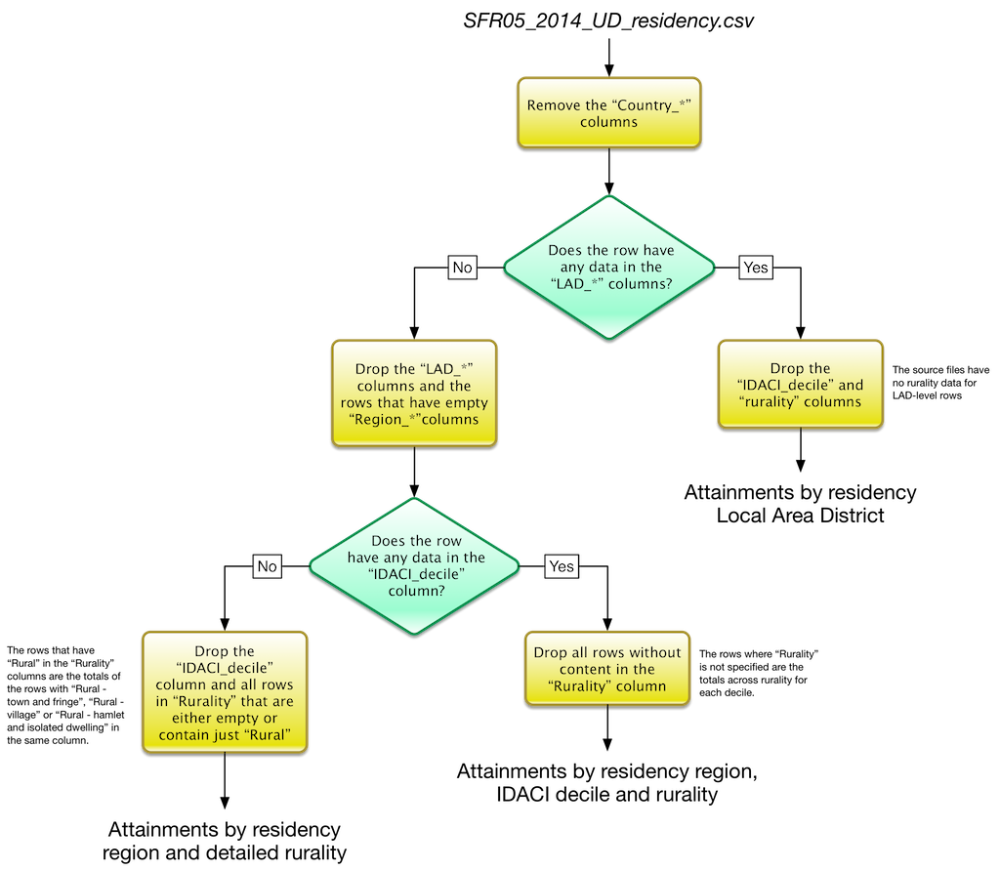

GCSE and equivalent attainment by pupil characteristics: 2012 to 2013
=====================================================================

##Methodology

Data processing and cleansing developed through the two stages described below:

- [Stage 1](#stage-1): choice of which of the original files to further process and semantic analysis
- [Stage 2](#stage-2): normalisation and identification of missing data

Below is a description of the contents in this project, by folder.
- *data*
    - *raw*: the source publication webpage, dataset and documentation as found at the source web address
    - *preprocessed*: selected datasets from the 'raw' folder, cleansed and homogenised according to data science best practices
    	- *01_stage_1* this folder collects the parts of the raw data that the team selected as worth further processing 
    	- *02_stage_2* this folder is the result of the first stage of processing, mainly aimed at making the contents of *01_stage_1* onto a canonical form according to the team's interpretation of the data. 
- *images*: all images used for this documentation
- *scripts*
	- *stage_2*: the [OpenRefine](http://openrefine.org/) operation history and [R](http://www.r-project.org/) scripts used for the processing of stage 2.

###Stage 1

After a first analysis of the set of files that were published, we originally decided to ignore all data but for the contents of the [*SFR05_2014_Underlying_data.zip*](data/raw/SFR05_2014_Underlying_data.zip) file. The rationale for this is that our intention is to prepare the data for exploration without considering the publisher's own conclusions and trying to be influenced by them as little as possible. The zip file's contents are now in the [*01_stage_1*](data/processed/01_stage_1/) folder.

Among the contents, [*SFR05_2014_UD_metadata.txt*](data/processed/01_stage_1/SFR05_2014_UD_metadata.txt) was identified as their key. The file describes elements of the source data's background, coverage, data quality and statistical disclosure (anonymisation). The document also has a full explaination of the acronyms used in the data and a description of the column names for each of the files. 

All the csv tables were loaded into OpenRefine for preliminary analysis. We soon realised that we could not interpret the datasets without studying the final reports, too, starting from [SFR05_2014_National_and_LA_tables.xls](data/raw/SFR05_2014_National_and_LA_tables.xls) where, by using formatting and indentation, the semantics of the data is clearly highlighted to the "human reader". 

A very good example is the *SFR05_2014_UD_residency.csv* file. Like most other files in the dataset, the file includes several **alternative** perspectives on the same data, that can be isolated from each other only by interpreting and filtering the values in the rows. The diagram below shows how the original file was 'distilled' into its three different perspectives.

The filenames can also be misleading, e.g. the two *SFR05_2014_UD_national_1.csv* and *SFR05_2014_UD_national_2.csv* files, are not one the continuation of the other, despite their names, and have different column sets.

Please note that we are no saying that the data was in anyway 'faulty' at this stage, but it was of difficult interpretarion and re-use because of some of the choices that were made by the issuer.

###Stage 2

In stage 2 we normalised the data in the *01_stage_1* folder trying to achieve a "canonical form" for the same. Redundant data was removed and the original csv files were split in specialised csv files each of which presented one and just one perspective on the data. The result is in [*01_stage_2*](data/processed/02_stage_2/). The names of the files produced during this stage are self-explanatory.

Below is the description of which output files were produced by which input files.

Source file | Destination file(s) 
----------- | ------------------- 
*SFR05_2014_UD_national_1.csv* | *Attainments_by_EAL.csv* *Attainments_by_FSM.csv* *Attainments_by_SEN_provision.csv* *Attainments_by_primary_need_status.csv* *Attainments_by_disadvantage.csv* *Attainments_by_disadvantaged_schools.csv* *Attainments_by_ethnicity.csv* 

Note that all files distinguish attainment also by the pupil's gender, but that is not specified in the filename.

For each of the files, we:
- removed any empty rows
- removed the "Country_code_9_digit", "Country_code" and "Country_name" columns that have the same values for all records, respectively "E92000001", 921 and "England"
- identified and removed any rows that had consolidated data from other rows (totals by region, totals by rurality, etc.)

When necessary, we 'specialised' the contents of the *Characteristic_category* column, e.g. in *Attainments_by_SEN_provision.csv* we highlighted that "School Action" and "School Action+" are SEN categories "without a statement".

The files were processed using OpenRefine. The operation history for each file is in the [scripts/stage_2](script/stage_2) folder. The filenames are the same as the csv they produced, but end with a *.openrefine.json* extension.

**Issue** - The figures in the categorisation by primary need status do not sum up. Our assumption is that the "All SEN primary need pupils" row in the original file is supposed to be the sum of all other rows. This is further hinted by the fact that the rows include a "Other Difficulty/Disability" row, and that the sum of all rows is always less than the "All SEN primary need pupils" row. There is instead, on average, a 1.65% gap that is unaccounted for. To address this we have created a "Not classified" row with the number of unaccounted pupils. The matter should be investigated with the source of the original data.

Note that the above inconsistency somehow jumped to the eye, but the time we had available was not sufficient to run analogous cross-checks between the summary and non-summary rows across the entire dataset.

---

Source file | Destination file(s) 
----------- | ------------------- 
*SFR05_2014_UD_national_2.csv* | *Attainments_by_SEN_provision_and_ethnicity.csv*

The operations on the files were the same as for *SFR05_2014_UD_national_1.csv*.

---

Source file | Destination file(s) 
----------- | ------------------- 
*SFR05_2014_UD_LA_1.csv* | *Attainments_by_LA.csv*

The operations on the files were the same as for *SFR05_2014_UD_LA_1.csv*.

---

Source file | Destination file(s) 
----------- | ------------------- 
*SFR05_2014_UD_LA_2.csv* | *Attainments_by_LA_et_al.csv*

The operations on the files were the same as for *SFR05_2014_UD_LA_1.csv*.

---

Source file | Destination file(s) 
----------- | ------------------- 
*SFR05_2014_UD_parliamentary_constituency.csv* | *Attainments_by_parliamentary_constituency.csv*

The operations on the files were the same as for *SFR05_2014_UD_national_1.csv*.

---

Source file | Destination file(s) 
----------- | ------------------- 
*SFR05_2014_UD_residency.csv* | *Attainments_by_residency_region_IDACI_rurality.csv* *Attainments_by_residency_region_and_rurality_detail.csv* *Attainments_by_residency_LAD.csv*

The operations on the files were the same as for *SFR05_2014_UD_national_1.csv*.

---

Source file | Destination file(s) 
----------- | ------------------- 
*SFR05_2014_UD_school_location.csv* | *Attainments_by_school_region_and_rurality_detail.csv* *Attainments_by_school_LAD.csv*

The operations on the files were the same as for *SFR05_2014_UD_national_1.csv*.

---

Finally, all summary columns (e.g. "NATden_all_13" with the sum of "NATden_girls_13" and "NATden_boys_13") have been removed across all files by running the *removeSummaryColumns.R* script in the [scripts/stage_2](script/stage_2) folder.
